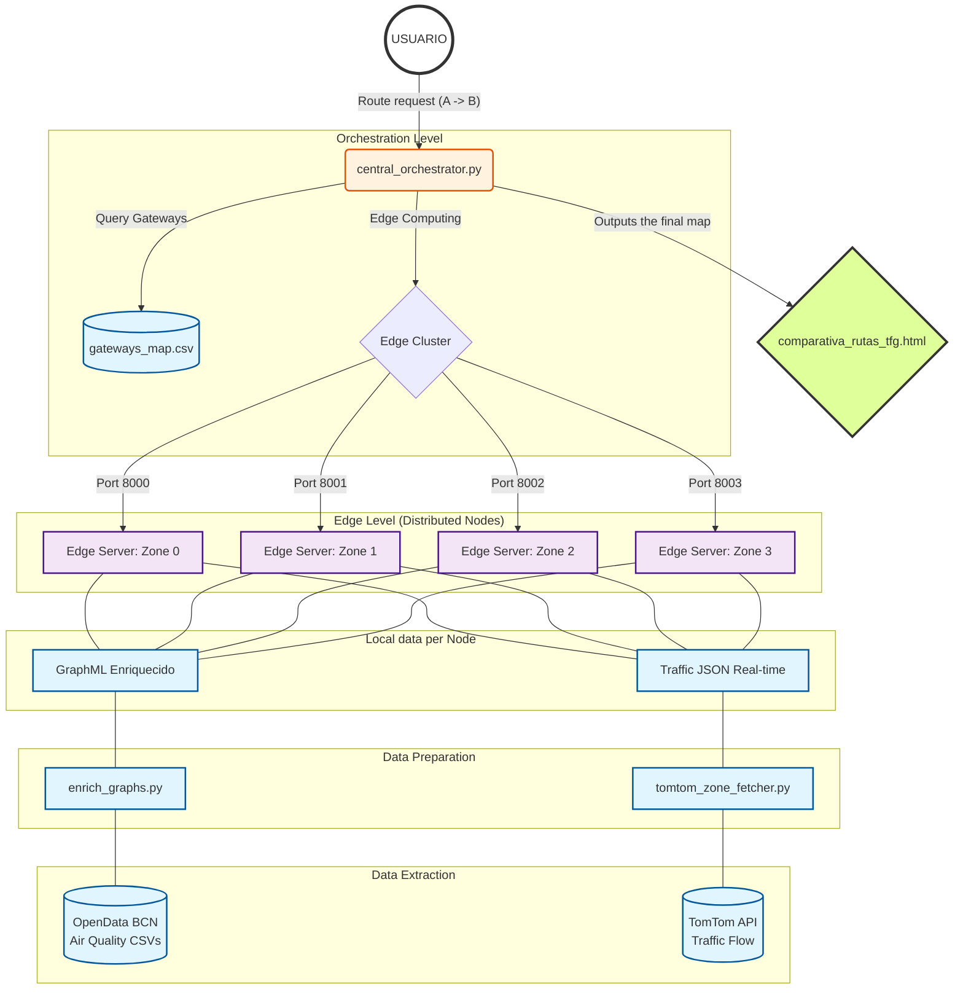
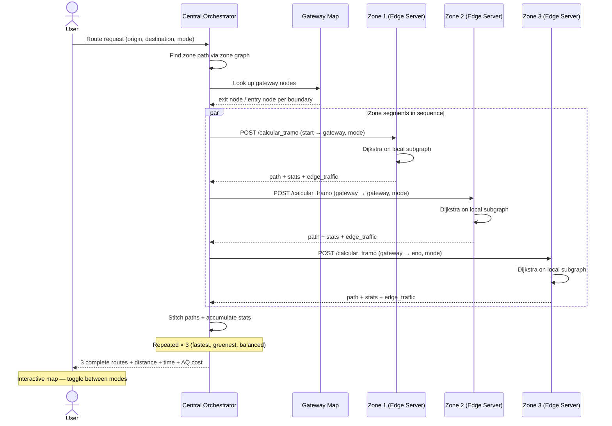

# Eco-Route Planner — Distributed Edge Computing System

A distributed routing system for Barcelona that calculates eco-friendly vehicle routes by combining real-time traffic data (TomTom) and live air quality measurements (OpenData BCN). Built as a Bachelor's Thesis (TFG) project.

The city is split into 4 geographic zones, each managed by an independent edge server. A central orchestrator decomposes cross-zone route requests, queries the relevant edge nodes, and stitches the results into a complete route with three modes: **Fastest**, **Greenest**, and **Balanced**.

---

## File Structure

- **`edge_server.py`** — FastAPI server, one instance per zone. Loads the enriched zone subgraph, snaps TomTom traffic data to graph edges, and exposes a `/calcular_tramo` endpoint that runs Dijkstra and returns the path, stats, and per-edge traffic levels.

- **`central_test.py`** — The central orchestrator. Queries the relevant edge servers, stitches path segments together, accumulates route statistics, and generates the interactive HTML comparison map.

- **`enrich_graphs.py`** — Offline enrichment script. Reads Barcelona air quality CSVs and injects `pollution_cost` onto every edge in each zone GraphML. Run once, or whenever you want to refresh pollution data.

- **`subgraph_zone_N_enriched.graphml`** — Enriched road subgraph for zone N (0–3). OSM topology plus air quality attributes on every edge. Generated by `enrich_graphs.py`.

- **`tomtom_zone_fetcher.py`** — Fetches real-time traffic flow tiles from the TomTom API per zone. Estimates `travel_time` per segment using a BPR congestion model and saves one `traffic_zone_N.json` per zone.

- **`gateways_map.csv`** — Defines how zones connect. Each row is a directed gateway: exit node in one zone → entry node in the adjacent zone. Used by the orchestrator to stitch cross-zone routes.

- **`traffic_zone_N.json`** — TomTom traffic segments for zone N, with `travel_time`, `current_speed`, and `traffic_level`. Generated by `tomtom_zone_fetcher.py`, loaded by the edge server at startup.

- **`comparativa_rutas_tfg.html`** — Interactive Leaflet map output. Toggle between the three route modes, with per-edge traffic colouring and a stats panel.

-**`map.py`** - Creates a visual HTML map with file named zone_map.html that shows the four different zones inside Barcelona

-**`jsonfilemaker.py`** - Creates barcelona_osm_tomtom.json file

-**`jsontodataframe.py`** - Creates enriched barcelona_osm_tomtom_pollution.json file. Takes as input geopackages downloaded from OpenData BCN Portal.


---

## How to Run

### 1. Install dependencies
```bash
pip install fastapi uvicorn osmnx networkx scipy numpy pandas requests folium mapbox-vector-tile
```

### 2. Enrich zone graphs with air quality data
Only needed once, or when refreshing pollution data:
```bash
python enrich_graphs.py
```

### 3. Fetch TomTom traffic data
```bash
# All 4 zones
python tomtom_zone_fetcher.py

# Single zone (faster for testing)
python tomtom_zone_fetcher.py --zone 0
```

### 4. Start the edge servers
Open 4 terminals, one per zone:
```bash
ZONE_ID=0 uvicorn edge_server:app --port 8000
ZONE_ID=1 uvicorn edge_server:app --port 8001
ZONE_ID=2 uvicorn edge_server:app --port 8002
ZONE_ID=3 uvicorn edge_server:app --port 8003
```

### 5. Run the orchestrator
```bash
python central_test.py
```
Prints route statistics for all three modes and generates `comparativa_rutas_tfg.html`. Open it in a browser to see the map.

---

## Routing Modes

| Mode | Edge weight | Optimises for |
|------|-------------|---------------|
| `fastest` | `travel_time` (seconds) | Minimum travel time, TomTom-aware |
| `greenest` | `pollution_cost` | Minimum pollution exposure |
| `balanced` | `0.5 × travel_time + 0.5 × pollution_cost` | Trade-off between time and air quality |



