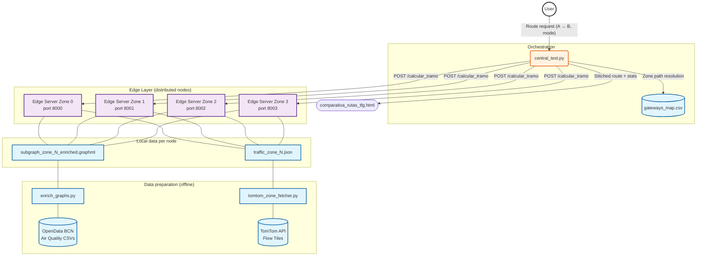
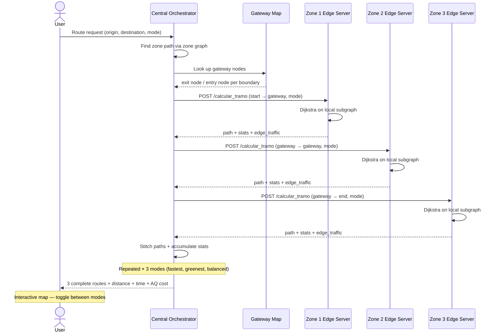

# Eco-Route Planner — Distributed Edge Computing System

A distributed routing system for Barcelona that calculates eco-friendly vehicle routes by combining real-time traffic data (TomTom API) and live air quality measurements (OpenData Barcelona). Built as a Bachelor's Thesis (TFG) at Universitat Pompeu Fabra.

The city is split into 4 geographic zones, each managed by an independent edge server. A central orchestrator decomposes cross-zone route requests, queries the relevant edge nodes, and stitches the results into a complete route with three modes: **Fastest**, **Greenest**, and **Balanced**.

---

## System Demonstration

The following figure showcases the final output of the proposed system, demonstrating the effective integration of real-time air quality data into the routing algorithm:


---

## Full Pipeline

The system is built and run in the following order:

```
jsonfilemaker.py
    → barcelona_osm_tomtom.json
jsontodataframe.py
    → barcelona_osm_tomtom_pollution.json
partition_graph.py
    → subgraph_zone_{0..3}.graphml + gateways_map.csv
enrich_graphs.py
    → subgraph_zone_{0..3}_enriched.graphml
tomtom_zone_fetcher.py
    → traffic_zone_{0..3}.json
edge_server.py × 4   (one per zone, ports 8000–8003)
central_test.py      (orchestrator + map output)
```

---

## File Structure

### Core scripts

- **`jsonfilemaker.py`** — Downloads the Barcelona road network from OpenStreetMap and queries the TomTom Point Flow API for real-time speeds on a sample of edges. Produces `barcelona_osm_tomtom.json`.

- **`jsontodataframe.py`** — Merges the road JSON with NO₂ and PM10 pollution GeoPackages from OpenData Barcelona using spatial joins. Produces `barcelona_osm_tomtom_pollution.json`.

- **`partition_graph.py`** — Partitions the enriched road graph into 4 zones using K-Means clustering, expands each zone with a 3-hop buffer for boundary overlap, extracts the largest strongly connected component per zone, and remaps gateway nodes. Produces `subgraph_zone_N.graphml` and `gateways_map.csv`.

- **`enrich_graphs.py`** — Reads hourly air quality CSVs from OpenData Barcelona and injects `pollution_cost` onto every edge in each zone subgraph using KDTree spatial matching. Produces `subgraph_zone_N_enriched.graphml`.

- **`tomtom_zone_fetcher.py`** — Fetches real-time traffic flow tiles from the TomTom Flow Tiles API for each zone's bounding box. Estimates `travel_time` per segment using a BPR congestion model. Produces `traffic_zone_N.json`.

- **`edge_server.py`** — FastAPI edge node server, one instance per zone. At startup, loads the enriched GraphML, snaps TomTom traffic data to graph edges via KDTree, and computes three weight layers per edge. Exposes `/calcular_tramo` which runs Dijkstra and returns the path, statistics, and per-edge traffic levels.

- **`central_test.py`** — Central orchestrator. Resolves the zone path, queries the relevant edge servers in sequence, stitches path segments together, accumulates route statistics, and generates the interactive HTML comparison map.

- **`mapa_bueno_.py`** — Generates `mapa_zonas_reales.html`, an interactive map showing the convex hull of each zone's actual road nodes on a Barcelona base map.

### Generated data files

- **`gateways_map.csv`** — Directed gateway connections between zones. Each row: exit node in one zone → entry node in the adjacent zone. Used by the orchestrator to stitch cross-zone routes.
- **`subgraph_zone_N_enriched.graphml`** — Enriched road subgraph for zone N (0–3). Contains OSM topology plus air quality attributes on every edge.
- **`traffic_zone_N.json`** — TomTom traffic segments for zone N with `travel_time`, `current_speed`, and `traffic_level`.
- **`barcelona.graphml`** — Full Barcelona road graph used by the orchestrator to render the output map.

### Output files

- **`comparison_routes_tfg.html`** — Interactive Leaflet map. Toggle between Fastest / Greenest / Balanced routes, with per-edge traffic colouring and a stats panel.
- **`mapa_zonas_reales.html`** — Zone boundary visualisation.
- **`estadisticas_rutas_tfg.csv`** — Route statistics for all tested origin-destination pairs and modes.

### Data folder (`data/`)

Required input files — must be downloaded manually from OpenData Barcelona:

| File | Source |
|------|--------|
| `Qualitat_Aire_Detall.csv` | [OpenData BCN — Air Quality Detail](https://opendata-ajuntament.barcelona.cat/data/es/dataset/qualitat-aire-detall-bcn) |
| `2026_qualitat_aire_estacions.csv` | [OpenData BCN — Air Quality Stations](https://opendata-ajuntament.barcelona.cat/data/es/dataset/qualitat-aire-estacions-bcn) |
| `2023_tramer_no2_mapa_qualitat_aire_bcn.gpkg` | [OpenData BCN — NO₂ map](https://opendata-ajuntament.barcelona.cat/data/ca/dataset/mapes-immissio-qualitat-aire) |
| `2023_tramer_pm10_mapa_qualitat_aire_bcn.gpkg` | [OpenData BCN — PM10 map](https://opendata-ajuntament.barcelona.cat/data/ca/dataset/mapes-immissio-qualitat-aire) |

---

## How to Run

### 1. Install dependencies

```bash
pip install fastapi uvicorn osmnx networkx scipy numpy pandas requests folium \
            mapbox-vector-tile geopandas shapely scikit-learn prometheus-fastapi-instrumentator
```

### 2. Build the road + pollution JSON (run once)

```bash
python jsonfilemaker.py       # Downloads OSM graph + TomTom point speeds
python jsontodataframe.py     # Merges with pollution GeoPackages
```

### 3. Partition the graph into zones (run once, or to reset zones)

```bash
python partition_graph.py
```

### 4. Enrich zones with air quality data (run once, or to refresh)

```bash
python enrich_graphs.py
```

### 5. Fetch TomTom traffic data (run before each session)

```bash
# All 4 zones
python tomtom_zone_fetcher.py

# Single zone (faster for testing)
python tomtom_zone_fetcher.py --zone 0
```

### 6. Start the edge servers

Open 4 terminals, one per zone:

```bash
ZONE_ID=0 uvicorn edge_server:app --port 8000
ZONE_ID=1 uvicorn edge_server:app --port 8001
ZONE_ID=2 uvicorn edge_server:app --port 8002
ZONE_ID=3 uvicorn edge_server:app --port 8003
```

### 7. Run the orchestrator

```bash
python central_test.py
```

Prints route statistics for all three modes and generates `comparativa_rutas_tfg.html`. Open it in a browser to see the interactive map.

---

## Routing Modes

| Mode | Edge weight | Optimises for |
|------|-------------|---------------|
| `fastest` | `travel_time` (seconds) | Minimum travel time, TomTom-aware |
| `greenest` | `pollution_cost` | Minimum pollution exposure (NO₂, PM10, PM2.5) |
| `balanced` | `0.5 × travel_time + 0.5 × pollution_cost` | Trade-off between time and air quality |

---

## Architecture

### System Architecture Diagram


### Sequence diagram

